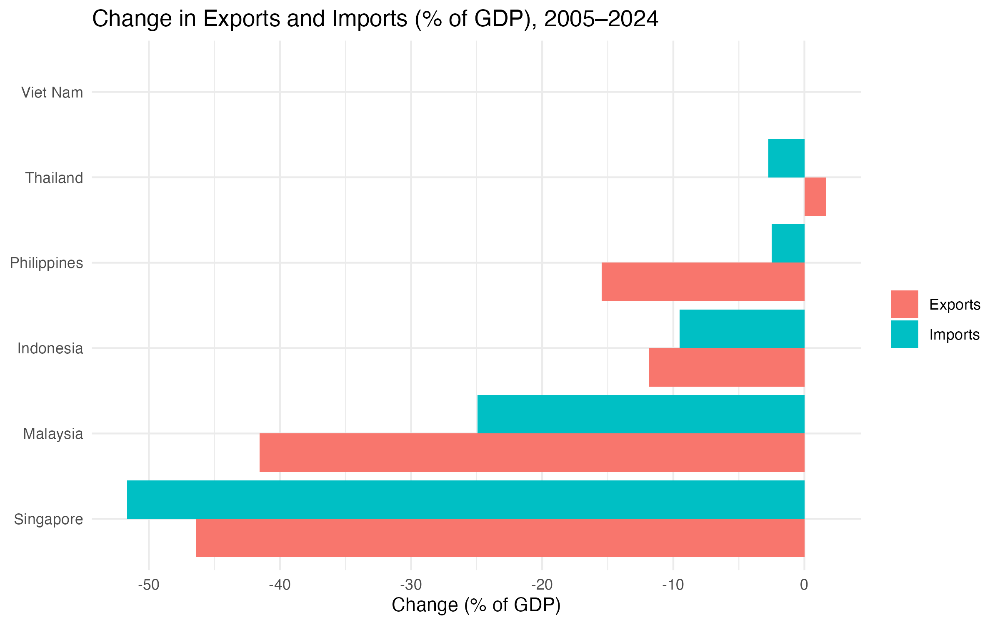

# Southeast Asia Trade Analysis (2005–2024)

## Overview
This project analyzes trade patterns for six ASEAN economies **Malaysia, Philippines, Vietnam, Thailand, Indonesia, Singapore** from 2005 to 2024.

The analysis covers:
- **Trade balance** (% of GDP)
- **Exports vs. Imports** (% of GDP)
- **Long-term average trade performance**
- **Top Movers** changes in trade shares between 2005 and 2024

## Key Visuals
### 1. Trade Balance Trends


**Analysis:**  
This graph highlights stark differences in trade performance across the ASEAN6. **Singapore** consistently maintains a significantly higher trade balance relative to GDP, likely due to its role as a re-export hub and highly open economy (World Bank, 2023). In contrast, **Indonesia** and **the Philippines** show modest trade balances, reflecting higher dependence on imports and less export diversification. **Malaysia’s** gradual decline might signal structural export shifts, while **Vietnam’s** rising trend reflects FDI inflows and a stronger manufacturing base (ADB, 2022). These patterns offer insights into regional trade competitiveness and exposure to global shocks.

*Sources: World Bank, ADB, IMF (as cited in dataset)*  

### 2. Exports vs Imports


### 3. Average Trade Balance


### 4. Top Movers (Exports & Imports Changes 2005–2024)


## Summary Tables
- **[ASEAN6 Trade Summary (Excel)](data/processed/asean6_trade_summary.xlsx)**  
  Best and worst trade-balance years for each country.
- **[ASEAN6 Top Movers (Excel)](data/processed/asean6_top_movers.xlsx)**  
  Change in exports and imports (% of GDP) between 2005 and 2024.

## 🔎 Quick Insights
- Singapore and Malaysia maintain strong positive trade balances throughout the period.
- Vietnam’s export share grew significantly post-2010, narrowing its import gap.
- The Philippines and Indonesia tend toward more balanced trade shares, with smaller gaps between exports and imports.
- Thailand saw moderate declines in export share but remained positive in trade balance.

## 🛠️ How to Reproduce
**Data**: `TRADE1.xlsx` (sheet `Data`) with columns:  
`COUNTRY | YEAR | EXPORT | IMPORT | TRADE | GDP`

**R Setup**
```r
install.packages(c("tidyverse", "readxl", "writexl"))
